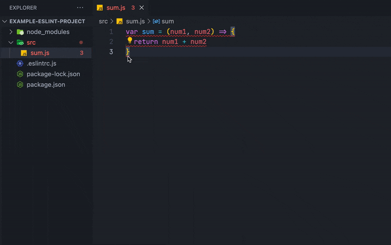
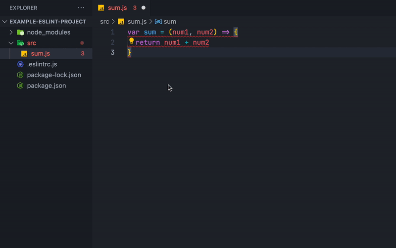

Bir zamanlar front-end'çilerin bir takım problemleri vardı. Kodlardaki syntax hatalarını görmek zordu, projelerindeki yazılım dilinin standardı yoktu ve bir yazılımcının `if` dediğine diğer `ternary` diyordu. Dolayısıyla codebase'i kontrol eden bir araca ihtiyaç vardı.

Bunu gören Nicholas C. Zakas duruma el attı ve ESLint’i yarattı.


## What is ESLint?

**ESLint**, kodları belirli kurallara göre analiz eden ve tespit ettiği problemleri belirlediğimiz kurallar çerçevesinde çözen Javascript aracıdır.

Statik bir analiz yaptığı için kodları çalıştırmadan bir takım problemleri keşfeder. Örneğin, bir `for` döngüsünde değişken tanımlamayı unutursanız veya sonsuz döngüye girerseniz sizi uyarır:

```js
// ESLint: The update clause in this loop moves the variable
// in the wrong direction. (for-direction)
for (i = 100; i >= 0; i++) {
  // ESLint: 'i' is not defined. (no-undef)
  console.log(`Sayı: ${i}`);
}
```

Hatalara karşı tavrı nettir. Bir gün taskınızı bitirmişsinizdir, arkanıza yaslanıp commit atarsınız ve ESLint kapınızı çalar:


## Setup Playground Project

Yazı boyunca örnekleri takip etmenizi istiyorum ve gerekli ortamı hazırlamak için alttaki talimatları takip edin.

```bash withOutput
> # istediğimiz bir dizinde klasör oluşturalım
> $ mkdir example-eslint-project && cd example-eslint-project
> # klasörümüzü npm projesine çevirelim.
> $ npm init -y
> # eslint paketini sadece localde çalışacağı deployment'a
> # dahil edilmeyeceği için devDependency olarak ekleyelim
> $ npm i eslint -D
> # eslint konfigürasyonu yapacağımız dosyayı oluşturmak
> # üzere hazırlanan programı kullanalım
> $ npm init @eslint/config

? How would you like to use ESLint?
  ✔ To check syntax and find problems
? What type of modules does your project use?
  ✔ JavaScript modules (import/export)
? Which framework does your project use?
  ✔ None of these
? Does your project use TypeScript?
  ✔ No
? Where does your code run? >
  ✔ Node
? What format do you want your config file to be in?
  ✔ JavaScript
```

İşlemlerin sonucunda `.eslintrc.js` dosyası oluşturulur. Bu dosya, ESLint'i konfigüre edeceğimiz yerdir.

```js title=.eslintrc.js
module.exports = {
  env: {
    // eslint'in global değişkenleri anlayabilmesi için gerekli
    // seçenekleri veririz. projede es2021 kullanıldığı ve
    // node kodları barındırdığını söyleyeceğiz.
    es2021: true,
    node: true,
  },
  // eslint'in kodları neye göre parse edeceğini belirtiriz.
  parserOptions: {
    ecmaVersion: "latest",
    sourceType: "module",
  },
  // önceden tanımlanmış kuralları import etmemizi sağlar.
  // örnekte eslint ekibinin önerdiği kuralları import ediyoruz.
  extends: ["eslint:recommended"],
  // kurallar ile eslintin ilgili sözdizimler karşısında nasıl
  // davranacağını belirleriz.
  rules: {},
};
```

Şimdilik başka hatalarla uğraşmadan ana konuya odaklanabilmek için `eslint:recommended`'ı kaldıracağız.

```js title=.eslintrc.js
module.exports = {
  env: {
    es2021: true,
    node: true,
  },
  parserOptions: {
    ecmaVersion: "latest",
    sourceType: "module",
  },
  extends: [],
  rules: {},
};
```

Konfigürasyonu ayrı dosyaya çıkarmak yerine `package.json`'un `eslintConfig` alanını da kullanabiliriz. Daha derli toplu durması ve sorumlulukların ayrılması ilkesi gereği `.eslintrc.js` ile ilerlemek sağlıklıdır.

```json title=package.json
{
  "name": "example-eslint-project",
  "version": "1.0.0",
  ...
  "eslintConfig": {
    "env": {
        "es2021": true,
        "node": true
    },
    "parserOptions": {
        "ecmaVersion": "latest",
        "sourceType": "module"
    },
    "extends": [],
    "rules": {}
  }
}
```

## Rules

ESLint'in bazı sözdizimleri karşısında nasıl davranacağını kurallar tanımlar.

```js
// usage 1
if (status === LoginStatus.LOGGED_OUT) {
  redirect("/login");
}

// usage 2
if (status === LoginStatus.LOGGED_OUT)
  redirect("/login");

// usage 3
if (status === LoginStatus.LOGGED_OUT) redirect("/login");
```

Örneğin yukarıdaki kullanımları kurala göre analiz eder ve belirlediğiniz davranışa göre aksiyon alır. Örneğin, kuralı "tek satır kod barındırıyorsa süslü parantez ile karşılaşırsan hata ver" şeklinde konfigüre ettiysek örnekteki ilk iki kullanım için hata alırız. Ardından otomatik formatlayabilirliğini kontrol eder.

## Define rule

Basit bir toplama fonksiyonu üzerinden ilerleyelim:

```js title=src/sum.js
var sum = (num1, num2) => {
  return num1 + num2;
};
```

Fonksiyonu incelersek göze çarpan ilk şey `var` kullanımıdır. "Bu devirde hala kullanan kaldı mı?" dediğinizi duyar gibiyim, hala aramızdalar! İkincisi ise noktalı virgül kullanılmamasıdır. Bazı insanlar sever bazı insanlar sevmez ancak otomatik formatlama hatalarının önüne geçmek için kullanmamızın yararı var. Dolayısıyla noktalı virgülün daima konulması ve `var` kullanılmamasına yönelik iki kural tanımlayacağız.

<Note type="info">
  Kuralların arkaplanda nasıl çalıştığına serinin diğer yazılarında değineceğiz. Şimdilik implementasyonuna odaklanalım.
</Note>

ESLint'te built-in [kurallar](https://eslint.org/docs/rules/) tanımlanılmıştır. `React`, `Typescript` gibi paketlere özgü kurallar için ekstra npm paketleri indirmemiz gerekir. İsteğimizle örtüşen ESLint kurallarına wiki'den bakarsak:

- `semi` kuralı, ifade sonlarına noktalı virgül konulmasını zorunlu kılar
  ya da kullanımını engeller.
- `no-var` kuralı, `var` yerine `let` ya da `const` kullanılmasını zorunlu kılar
  ya da `var` anahtar kelimesine izin verir.

Artık kurallarımızı etkinleştirelim.

```js title=.eslintrc.js
module.exports = {
  // ...
  rules: {
    semi: "error",
    "no-var": "error",
  },
};
```

ESLint kurallara verilen değerlere göre üç farklı şekilde davranır:

- `"off"` ya da `0` -- kuralı kapatır
- `"warn"` ya da `1` -- kuralı uyarı verecek biçimde etkinleştirir
- `"error"` ya da `2` -- kuralı hata verecek biçimde etkinleştirir

Bazı kurallar ise özelleştirebilmemize imkan sağlar. Farklı kullanım biçimlerini görmek için farklı kural tanımlarına bakalım.

```js title=.eslintrc.js
module.exports = {
  // ...
  rules: {
    "no-restricted-syntax": "off",
    // kuralların hata değil uyarı vermesini istiyorsak 'warn' verebiliriz.
    // bu kuralları düzeltme zorunluluğumuz yoktur.
    "spaced-comment": "warn",
    // "semi": ["error", "always"] şeklinde de yazabilirdik ancak varsayılan
    // değer 'always' olduğu için yazılmadan geçilebilir.
    semi: "error",
    quotes: ["error", "double"],
    // bazı kurallar `options` parametresi kabul eder.
    camelcase: ["error", { ignoreDestructuring: true }],
  },
};
```

Örneğimize geri dönüp tanımladığımız kurallarla birlikte kodumuzu ESLint'e analiz ettirelim.

```bash withOutput
> $ npx eslint src/sum.js

/Users/enes.baspinar/Projects/posts-codes/example-eslint-project/src/sum.js
    1:1   error  Unexpected var, use let or const instead  no-var
    2:21  error  Missing semicolon                         semi
    3:2   error  Missing semicolon                         semi

✖ 3 problems (3 errors, 0 warnings)
    3 errors and 0 warnings potentially fixable with the '--fix' option.
```

Üç adet hata üretti. Bunları elle düzeltebiliriz falan filan ama analizi yapan araç bunu da düzeltemez mi? Pekala düzeltebilir. [Dökümantasyona](https://eslint.org/docs/rules/) bakarsak bazı kuralların
yanlarında ingiliz anahtarı olduğunu görebilirsiniz. Bu "fixable" olduğunu yani otomatik düzeltilebildiği anlamına gelir. Kullandığımız iki kural da bu şekildedir.

"Fixable" olarak belirtilen kurallar komuta `--fix` bayrağı eklenerek düzeltilebilir.
Öncesinde kodumuza tekrar bakalım.

```js title=src/sum.js
var sum = (num1, num2) => {
  return num1 + num2;
};
```

Şimdi yeni bayrakla birlikte kodumuzu tekrar çalıştıralım.

```bash
$ npx eslint src/sum.js --fix
```

`src/sum.js` dosyasına yeniden baktığımızda değiştiğini görebiliriz.

```js title=src/sum.js
let sum = (num1, num2) => {
  return num1 + num2;
};
```

Muazzam bir şey değil mi?

## VSCode ESLint Extension

ESLint paketi bize lint özelliği sağlarken, VSCode eklentisi kod yazarken canlı bir şekilde otomatik lint özelliği sağlar ve hataları arayüzde görselleştirir.

Hemen indirip deneyelim.


İndirdikten sonra `src/sum.js` dosyamızı ilk haline getirip eklentinin
sihirine kapılalım.


<Note type="info">
  Bu menüyü fareyle açmak zorunda değilsiniz. Klavyeden `CTRL/CMD + .` kombinasyonunu kullanabilirsiniz.
</Note>

Peki bizim için son bir şarkı çalıp `CTRL/CMD + S` ile dosyayı kaydettiğimizde tüm düzeltmeleri otomatik yapsa? O halde hemen VSCode ayarlarına girip bir ekleme yapalım.

```json title=settings.json {3-6}
{
  ...
  "editor.formatOnSave": true,
  "editor.codeActionsOnSave": {
    "source.fixAll": true
  }
}
```

<Note type="info">
  Dosya her kaydedildiğinde düzeltme yapmasını istemeyeceğimiz durumlar olabilir. Aşağıdaki değişikliği atlayıp VSCode'a sağ tıkladığımızda çıkan menüden "Format Document" seçeneğini kullanabilirsiniz.
</Note>

Artık dosyayı kaydettiğimizde otomatik düzelttiğini görebiliriz.



Bu yeteneğinin yalnızca küçük bir parçası. Kod yazma hızımızı ne kadar arttıracağını hayal edin.
Sık dosya kaydettiğimiz için alışmak güzel bir kazanım olur. Kendimden örnek verecek
olursam neredeyse her kelimeden sonra kendimi `CTRL/CMD + S` yaparken buluyorum.

## Disable Rules

Pekala artık hatamızı kollayan iki tane kuralımız var ve başımıza bela oldular. Bundan kurtulmak için, "Kodda sulh, cihanda sulh." ilkesiyle projede özgür takılmamıza izin verecek `freedom.js` isimli bir dosya oluşturalım ve bu dosya, özgür dünyanın projemizdeki temsili olsun. Herkes istediği gibi geliştirme yapabilsin. Üç yöntem vardır:

- Tüm kuralları tüm dosya için devre dışı bırakabiliriz.

```js title=src/freedom.js
/* eslint-disable */

var sum = (num1, num2) => {
  return num1 + num2;
};
```

- Tüm kuralları dosyanın bir kısmında devre dışı bırakabiliriz.

```js title=src/freedom.js
/* eslint-disable */

var sum = (num1, num2) => {
  return num1 + num2;
};

/* eslint-enable */

// give error
var sqr = (num1) => {
  return num1 ** 2;
};
```

- Tüm kuralları satır bazlı devre dışı bırakabiliriz.

```js title=src/freedom.js
// eslint-disable-next-line
var sqr = (num1) => {
  return num1 ** 2; // eslint-disable-line
}; // eslint-disable-line
```

Yukarıdaki örneklerde tüm kurallar devre dışı kalır. Spesifik olarak belirtmek istersenz yanlarına kural isimlerini verebilirsiniz.

```js title=src/freedom.js
// eslint-disable-next-line no-var
var sqr = (num1) => {
  return num1 ** 2; // eslint-disable-line no-var semi
}; // give 'semi' error
```

## Summary

ESLint, spesifik kurallar dahilinde kodu analiz eder ve kod stilini belirli
kalıplarda tutar. Böylece çok fazla kişinin çalıştığı projelerin her satırı ayrı
telden çalmaz. Aynı zamanda noktalı virgül, boşluk gibi çok fazla kullandığınız
stillendirmeleri otomatik formatlamak için de faydalıdır.

`.eslintrc.js` dosyasından ya da `package.json` dosyasının `eslintConfig` alanından, ESLint'in doğru parse yapabilmesi için gerekli ayarlamalar yapılabilir ve kuralları düzenleyebiliriz.

```js title=.eslintrc.js
module.exports = {
  env: {
    es2021: true,
    node: true,
  },
  parserOptions: {
    ecmaVersion: "latest",
    sourceType: "module",
  },
  rules: {
    semi: "error",
    "no-var": "error",
  },
};
```

VSCode ESLint eklentini kullanarak çıktıları editörde canlı canlı görebiliriz. Aynı zamanda otomatik formatlamayı dosya kaydedildiğinde veya tuş kombinasyonlarına basıldığında tetikletebiliriz.



---

İlk yazımız burada biter. Serinin devamında çok daha fazla
şaşıracağınıza taahhüt ediyorum. Sağlıcakla kalın.