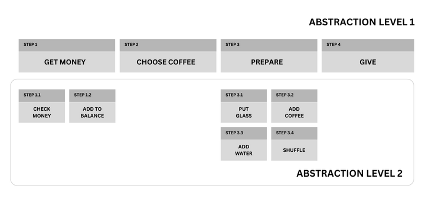

**Single Level of Abstraction (SLA)** is a software design principle that emphasizes the importance of having expressions at the same level of abstraction within a function, aiming to enhance readability. It also ensures that it conforms to the **Single Responsibility (SR)** principle.

<Note type="info">
In other articles related to this topic, they often jump into examples without explaining what abstraction level means. Fortunately, we won't skip the most important point.
</Note>

## What is Abstraction Level?

Every function performs an action, which often includes sub-actions. The level of these sub-actions indicates the abstraction level. That's essentially what it is.

Let's illustrate this with an example of a coffee machine.



If we want to buy a coffee from a machine, we put the money in, choose the type we want, wait for it to be prepared, and take it. These steps are at the first level of abstraction because they are the basic steps for this case.

These user interactions trigger other actions in the background. During the coffee preparation phase, the machine takes the cup, adds coffee, pours hot water, and shuffles. These steps are at the second level of abstraction (the sub-actions of the money insertion are the same way). They are actions that the user who wants to buy coffee should not focus on. It would be an unnecessary detail if you put the cup in the machine or stir the coffee yourself. But if there is no cup in the machine, then you need to check the relevant functionality.

Let's see the instruction sequence dummy code that violates the principle.

```java
getCoffee() {
  checkMoney();      // abstraction lvl 2
  addToBallance();   // abstraction lvl 2
  chooseCoffeType(); // abstraction lvl 1
  getGlass();        // abstraction lvl 2
  putCoffee();       // abstraction lvl 2
  putWater();        // abstraction lvl 2
  shuffleGlass();    // abstraction lvl 2
  giveCoffee();      // abstraction lvl 1
}
```

We don't add the balance ourselves or check the money, right? So this is abstracted from the user. Let's refactor the code to add extra abstraction.

```java
getCoffee() {
  getMoney();        // abstraction lvl 1
  chooseCoffeType(); // abstraction lvl 1
  prepareCoffee();   // abstraction lvl 1
  giveCoffee();      // abstraction lvl 1
}
```

## Code Examples

`calculateSum()` conforms to the SLA principle, only including the details of calculating the sum. It defines a variable that holds the calculation result, adds the other numbers to it and returns it.

```java
public int calculateSum(int[] numbers) {
  int sum = 0;

  for (int num : numbers) {
   sum += num;
  }

  return sum;
}
```

But `validateUser()` contains different abstraction levels. `isValidEmail()` is at the second level of abstraction. The main purpose of the function is to check if the user is valid. However, when looking at the code, we also see the details of the validation process and error handling, indicating the presence of multiple abstraction levels. To compare their readability, take a closer look at the `validateUser()` function.

```java
public boolean validateUser(User user) {
  if (user.getName().isEmpty()) {
    System.out.println("Name cannot be empty.");
    return false;
  }

  if (user.getEmail().isEmpty()) {
    System.out.println("Email cannot be empty.");
    return false;
  }

  if (!isValidEmail(user.getEmail())) {
    System.out.println("Invalid email format.");
    return false;
  }

  if (user.getPassword().isEmpty()) {
    System.out.println("Password cannot be empty.");
    return false;
  }

  if (user.getPassword().length() < 8) {
    System.out.println("Password must be at least 8 characters long.");
    return false;
  }

  return true;
}
```

The refactored version of `validateUser()` is as follows.

```java
public boolean validateUser(User user) {
  if (!hasValidName(user)) { // name validation details abstracted
    logError("Invalid name"); // logging details abstracted
    return false;
  }

  if (!hasValidEmail(user)) { // email validation details abstracted
    logError("Invalid email"); // logging details abstracted
    return false;
  }

  if (!hasValidPassword(user)) { // şifre validation details abstracted
    logError("Invalid password"); // logging details abstracted
    return false;
  }

  return true
}
```

Even if the amount of code increases with new functions, pay attention to how easy it is to read and how easy it is to maintain. For example, imagine you are checking for age verification in the validation phase:

- You examine the function.
- You quickly see the validation steps and notice that age verification is missing.
- If necessary, you create a validation function for age verification and integrate it into the code.

It's done. Since the abstraction is very sharp, you don't need to go through hundreds of lines of code to see which code verifies age by extracting password and email verification details.

## Practice

Assume you have a function that calculates the total price of a product list, and take a minute to analyze why it violates the SLA principle. Try to refactor it yourself following the principle of **No Pain, No Gain**.

```java
public int calculateTotalCartPrice(CartItem[] cartItems) {
  int totalPrice = 0;

  for (CartItem cartItem : cartItems) {
    totalPrice += cartItem.getPrice();

    if (cartItem.isTaxable()) {
      totalPrice += cartItem.getPrice() * 0.18;
    }

    if (cartItem.getCategory().equals("Electronics")) {
      if (cartItem.getPrice() > 500) {
        totalPrice -= 50;
      }
    }
  }

  return totalPrice;
}
```

When we examine the function, we can see that it adds the product price to the total amount, adds the product tax to it and finally deducts the discount amount if available. We can split the code into three parts. Let's refactor it step by step:

The logic for calculating the product price within the loop in `calculateTotalCartPrice()` is at a different level of abstraction than the rest of the code. Let's extract it into a separate function.

  <Note type="warning">
    If a function contains a loop, it probably contains a piece of code that violates the Single Level of Abstraction.
  </Note>

```java
public int calculateTotalCartPrice(CartItem[] cartItems) {
  int totalPrice = 0;

  for (CartItem cartItem : cartItems) {
    totalPrice += calculateCartItemPrice(cartItem);
  }

  return totalPrice;
}

private int calculateCartItemPrice(CartItem cartItem) {
  int cartItemPrice = cartItem.getPrice();       // abstraction level 1

  if (cartItem.isTaxable()) {
    cartItemPrice += cartItem.getPrice() * 0.18; // abstraction level 2
  }

  if (cartItem.getCategory().equals("Electronics")) {
    if (cartItem.getPrice() > 500) {             // abstraction level 2
      cartItemPrice -= 50;
    }
  }

  return cartItemPrice;
}
```

We have successfully refactored the `calculateTotalCartPrice()` function, but the new function still has different levels of abstraction. The main action of this function is to return the price of the product, but the calculation of tax and discount are sub-actions.

  <Note type="warning">
    If you use an verb when voicing what your code does, there is a piece of code that you need to extract to the function. Let's look at the example above:

    - Get product price (this action is already the reason for creating this function)
    - Calculate tax (must be extracted to function)
    - Calculate discount (must be extracted to function)
    - Return finally price (this action is already the reason for creating this function)
  </Note>

  ```java
  public int calculateTotalCartPrice(CartItem[] cartItems) {
    int totalPrice = 0;

    for (CartItem cartItem : cartItems) {
      totalPrice += calculateCartItemPrice(cartItem);
    }

    return totalPrice;
  }

  private int calculateCartItemPrice(CartItem cartItem) {
    int cartItemPrice = cartItem.getPrice();

    if (cartItem.isTaxable()) {
      cartItemPrice += calculateTax(cartItem.getPrice());
    }

    if (isElectronicItem(cartItem)) {
      cartItemPrice -= calculateDiscount(cartItem.getPrice());
    }

    return cartItemPrice;
  }

  private int isElectronicItem(CartItem cartItem) {
    return cartItem.getCategory().equals("Electronics");
  }

  private int calculateTax(int price) {
    return price * 0.18;
  }

  private int calculateDiscount(int price) {
    return price > 500 ? 50 : 0;
  }
  ```

As a result of the refactor, we get a clean code and the blessings of future generations.

---

We want to write our code in a way that minimizes bugs and can be easily flexed in the future. Principles like **Single Level of Abstraction** also encourage writing clean code by refining the details