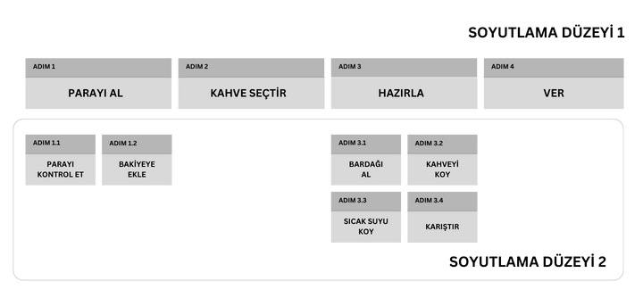

**Single Level of Abstraction (SLA)**, fonksiyondaki ifadelerin aynı soyutlama düzeyinde (**abstraction level**) olması gerektiğini belirten ve fonksiyonların okunabilirliğini arttırmayı amaçlayan yazılım tasarım prensibidir. Aynı zamanda **Single Responsibility (SR)** prensibine uygun hale gelmesini de sağlar.

> Konuyla ilgili diğer makalelerde, soyutlama düzeyinin ne olduğunu açıklamadan (adeta sahneleri kesilmiş korsan film edasıyla) örneklere atlıyorlar. Neyse ki masadayız ve en önemli noktaya değinmeden geçmeyeceğiz.

## Soyutlama Düzeyi Nedir?

Her fonksiyon bir eylem gerçekleştirir. Eylemler de çoğu zaman alt eylemlerin bütünüdür. İşte bu alt eylemlerin düzeyi, soyutlama düzeyini belirtir. Teorik teorik konuşup anlamını bulandırmaya gerek yoktur.

Kahve makinesini örneği üzerinden ele alalım.



Bir makineden kahve almak istersek parayı atar, istediğimiz çeşidi seçer, hazırlanmasını bekler ve alırız. Bu adımlar, birinci soyutlama düzeyindedirler çünkü otomattan kahve almak için gereken temel adımlardır.

Kullanıcının etkileşime girdiği bu eylemler, arkaplanda başka eylemleri harekete geçirir. Kahve hazırlama aşamasında makine; bardağı alır, kahveyi koyar, sıcak su ekler ve karıştırır. Bu adımlar ise ikinci soyutlama düzeyindedir (parayı alma eyleminin alt eylemleri de aynı şekildedir). Kahve almak isteyen kullanıcının odaklanmaması gereken eylemlerdir. Makineye bardağı sizin koymanız ya da kahveyi sizin karıştırmanız gereksiz bir detay olurdu. Ancak bölmeye bardak konulmuyorsa o zaman ilgili fonksiyonelliği kontrol etmeniz gerekir.

Prensibini ihlal eden talimat dizisini dummy koda dökelim.

```java
getCoffee() {
  checkMoney();       // abstraction lvl 2
  addToBallance();    // abstraction lvl 2
  chooseCoffeeType(); // abstraction lvl 1
  getGlass();         // abstraction lvl 2
  putCoffee();        // abstraction lvl 2
  putWater();         // abstraction lvl 2
  shuffleGlass();     // abstraction lvl 2
  giveCoffee();       // abstraction lvl 1
}
```

Parayı bakiyeyi kendimiz eklemiyoruz ya da paranın sahtelik kontrolünü kendimiz yapmıyoruz değil mi? Yani bu iş kullanıcıdan soyutlanmıştır. Ekstra soyutlaştırma ekleyecek şekilde kodu refactor edelim.

```java
getCoffee() {
  getMoney();         // abstraction lvl 1
  chooseCoffeeType(); // abstraction lvl 1
  prepareCoffee();    // abstraction lvl 1
  giveCoffee();       // abstraction lvl 1
}
```

Artık prensibe uygun hale getirmiş olduk.

## Kod Örnekleri

`calculateSum()` SLA prensibine uygundur, yalnızca toplamın hesaplanmasıyla ilgili ayrıntıları içerir. Hesaplama sonucunu tutan bir değişken tanımlar, diğer sayıları buna ekler ve döndürür.

```java
public int calculateSum(int[] numbers) {
  int sum = 0;

  for (int num : numbers) {
   sum += num;
  }

  return sum;
}
```

`validateUser()` fonksiyonu ise farklı soyutlama düzeyleri içerir. `isValidEmail()` ikinci soyutlama düzeyindedir. Fonksiyonun asıl amacı kullanıcının geçerli bir kullanıcı olduğunu kontrol etmektir. Ancak koda baktığımızda, doğrulama ve loglama işlemlerinin detaylarını da görürüz. Bu da birden fazla soyutlama düzeyinin varlığına işaret eder. Refactor sonrasında okunabilirlikleri karşılaştırabilmeniz adına `validateUser()` fonksiyonunu inceleyin.

```java
public boolean validateUser(User user) {
  if (user.getName().isEmpty()) {
    System.out.println("Name cannot be empty.");
    return false;
  }

  if (user.getEmail().isEmpty()) {
    System.out.println("Email cannot be empty.");
    return false;
  }

  if (!isValidEmail(user.getEmail())) {
    System.out.println("Invalid email format.");
    return false;
  }

  if (user.getPassword().isEmpty()) {
    System.out.println("Password cannot be empty.");
    return false;
  }

  if (user.getPassword().length() < 8) {
    System.out.println("Password must be at least 8 characters long.");
    return false;
  }

  return true;
}
```

`validateUser()`'ın refactor edilmiş hali aşağıdaki gibidir.

```java
public boolean validateUser(User user) {
  if (!hasValidName(user)) { // isim doğrulama detayları soyutlandı
    logError("Invalid name"); // loglama detayları soyutlandı
    return false;
  }

  if (!hasValidEmail(user)) { // email doğrulama detayları soyutlandı
    logError("Invalid email"); // loglama detayları soyutlandı
    return false;
  }

  if (!hasValidPassword(user)) { // şifre doğrulama detayları soyutlandı
    logError("Invalid password"); // loglama detayları soyutlandı
    return false;
  }

  return true
}
```

Yeni fonksiyonlarla birlikte kod miktarı artsa bile rağmen ne kadar kolay okunabildiğine ve bakımının ne kadar kolay olacağına dikkat edin. Örneğin doğrulama aşamasında yaş doğrulamasının olup olmadığını kontrol ettiğinizi düşünün:

- `validateUser()`'ı kontrol edersiniz.
- Hangi doğrulama aşamalarını barındırdığını hızlıca görüp yaş doğrulamasının olmadığını farkedersiniz.
- Gerekliyse yaş doğrulaması için doğrulama fonksiyonu oluşturup koda entegre edersiniz.

Bitti gitti. Soyutlama çok keskin olduğundan şifre ve email doğrulama detaylarını ayıklayarak hangi kod yaş doğruluyor diye yüzlerce satır incelemenize gerek kalmaz.

## Uygulama

Verdiğimiz ürün listesinin toplam fiyatını hesaplayan bir fonksiyonunuzun olduğunu varsayalım ve bir dakikanızı ayırarak kodun SLA prensibini neden ihlal ettiğini analiz edin. **Emeksiz Ekmek Olmaz (EEO)** prensibi gereği kendiniz refactor etmeye çalışın.

```java
public int calculateTotalCartPrice(CartItem[] cartItems) {
  int totalPrice = 0;

  for (CartItem cartItem : cartItems) {
    totalPrice += cartItem.getPrice();

    if (cartItem.isTaxable()) {
      totalPrice += cartItem.getPrice() * 0.18;
    }

    if (cartItem.getCategory().equals("Electronics")) {
      if (cartItem.getPrice() > 500) {
        totalPrice -= 50;
      }
    }
  }

  return totalPrice;
}
```

Fonksiyonu incelediğimizde ürün fiyatını toplama tutara eklediğini, üzerine ürün vergisini eklediğini ve son olarak mevcutsa indirim miktarını düştüğünü görebiliriz. Kodu mantıksal olarak üç parçaya bölebiliriz. Adım adım refactor edelim:

- `calculateTotalCartPrice()`'daki döngü içinde ürün fiyatını hesaplayan mantık kodun geri kalanından farklı soyutlama düzeyindedir. Ayrı bir fonksiyona çıkaralım.

  <Note type="info">
    Bir fonksiyonda döngü varsa Single Level of Abstraction'a aykırı kod parçası içermesi muhtemeldir.
  </Note>

```java
public int calculateTotalCartPrice(CartItem[] cartItems) {
  int totalPrice = 0;

  for (CartItem cartItem : cartItems) {
    totalPrice += calculateCartItemPrice(cartItem);
  }

  return totalPrice;
}

private int calculateCartItemPrice(CartItem cartItem) {
  int cartItemPrice = cartItem.getPrice();       // abstraction level 1

  if (cartItem.isTaxable()) {
    cartItemPrice += cartItem.getPrice() * 0.18; // abstraction level 2
  }

  if (cartItem.getCategory().equals("Electronics")) {
    if (cartItem.getPrice() > 500) {             // abstraction level 2
      cartItemPrice -= 50;
    }
  }

  return cartItemPrice;
}
```

- `calculateTotalCartPrice()`'ı başarıyla refactor ettik ancak yeni fonksiyonumuz da farklı soyutlama düzeylerine sahiptir. Bu fonksiyonun ana eylemi ürünün fiyatını döndürmektir ancak verginin ve indirimin hesaplanması alt eylemlerdir.

  <Note type="warning">
  Kodunuzun ne yaptığını seslendirirken eylem belirtiyorsanız orada fonksiyona çıkarmanız gereken kod parçası vardır. Yukarıdaki örneğe bakacak olursak:
  - Ürün fiyatını oku (bu eylem zaten bu fonksiyonun oluşturulma sebebidir)
  - Vergiyi hesapla (fonksiyona çıkarılması gerekir)
  - İndirimi hesapla (fonksiyona çıkarılması gerekir)
  - Nihai fiyatı dön (bu eylem zaten bu fonksiyonun oluşturulma sebebidir)
  </Note>

```java
public int calculateTotalCartPrice(CartItem[] cartItems) {
  int totalPrice = 0;

  for (CartItem cartItem : cartItems) {
    totalPrice += calculateCartItemPrice(cartItem);
  }

  return totalPrice;
}

private int calculateCartItemPrice(CartItem cartItem) {
  int cartItemPrice = cartItem.getPrice();

  if (cartItem.isTaxable()) {
    cartItemPrice += calculateTax(cartItem.getPrice());
  }

  if (isElectronicItem(cartItem)) {
    cartItemPrice -= calculateDiscount(cartItem.getPrice());
  }

  return cartItemPrice;
}

private int isElectronicItem(CartItem cartItem) {
  return cartItem.getCategory().equals("Electronics");
}

private int calculateTax(int price) {
  return price * 0.18;
}

private int calculateDiscount(int price) {
  return price > 500 ? 50 : 0;
}
```

Refactor sonucunda pirüpak bir kod elde etmiş oluruz ve gelecek nesillerin duasını alırız.

---

Kodlarımızı hatayı minimize edecek ve ileride kolayca esnekleştirebilecek biçimde yazmak isteriz. **Single Level of Abstraction** gibi prensipler de detayları arındırtarak iyi kod yazmaya teşvik ediyor. Kullanın kullandırın.