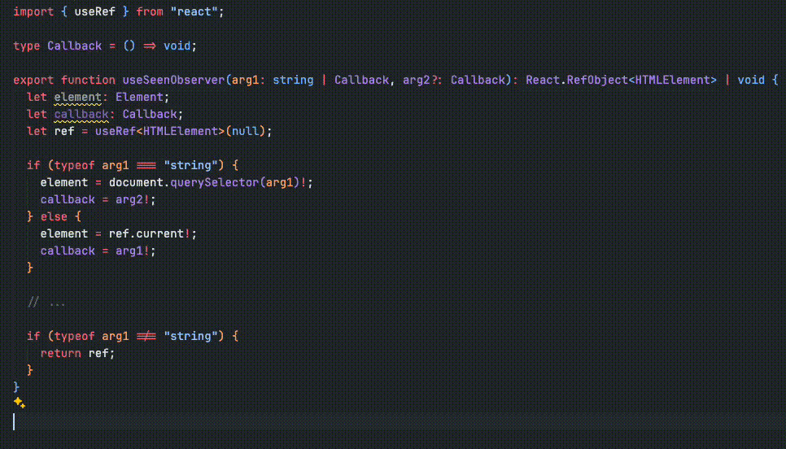

**Function overloading** is a feature in many programming languages that allows the creation of multiple functions with the same name but different parameters. This means you can define several functions with identical names, differing only in the number or type of parameters. This technique is beneficial for improving code readability, maintainability, and flexibility.

## Function overloading in OOP languages

In OOP languages like Java and C++, function overloading is a fundamental concept. It allows methods to be defined with the same name but different parameter lists. The correct method is selected at compile time based on the method signature, which includes the method name and parameter types.

### Java example

In Java it is implemented in the following syntax:

```java
class Notification {
  void send(String email, String message) {
    // ...
  }

  void send(String email, String message, boolean isUrgent) {
    // ...
  }

  void send(String email, String subject, String body) {
    // ...
  }
}

public class Main {
  public static void main(String[] args) {
    Notification notifier = new Notification();

    notifier.send("Hello!");
    notifier.send(
      "Reminder",
      "The meeting time has been changed to 10 AM."
    );
    notifier.send(
      "ensbaspinar@gmail.com",
      "Can you send me the plans for the team?",
      true
    );
  }
}
```

### C++ example

Also C++ has a similar syntax:

```cpp
class Notification {
public:
  void send(const string& message) {
    // ...
  }

  void send(const string& subject, const string& body) {
    // ...
  }

  void send(const string& email, const string& message, bool isUrgent) {
    // ...
  }
};

int main() {
  Notification notifier;

  notifier.send("Hello!");
  notifier.send(
    "Reminder",
    "The meeting time has been changed to 10 AM."
  );
  notifier.send(
    "ensbaspinar@gmail.com",
    "Can you send me the plans for the team?",
    true
  );
}
```

In both Java and C++, the overload resolution happens at compile time, ensuring that the appropriate method is invoked based on the arguments provided.

### How to handles function overloading?

1. **Function Signatures:** The compiler checks the signatures of functions. When multiple functions with the same name are defined, it checks whether the parameter lists of these functions are different. Unless there is a signature difference, a compilation error occurs.
2. **Name Mangling:** The compiler uses the name mangling technique to distinguish functions with the same name. With this technique, function names are made unique by encoding them together with their parameter types and numbers. For example, `foo(int)` and `foo(double)` are represented by the compiler with different names such as `foo_i` and `foo_d`.
3. **Call Resolution:** When a function is called, the compiler checks the types of the arguments to resolve which function the call corresponds to. A set of rules and precedence ordering is used to find the most appropriate function signature. If the compiler cannot find a match, or if there is more than one match, it will return a compilation error.

## Function overloading in TypeScript

TypeScript, being a statically typed superset of JavaScript, also supports function overloading but in a slightly different manner compared to traditional OOP languages. In TypeScript, function overloading is accomplished through the use of overload signatures and a single implementation.

### Example

```typescript
class Notification {
  send(message: string): void;
  send(subject: string, body: string): void;
  send(email: string, message: string, isUrgent?: boolean): void;

  send(arg1: unknown, arg2?: unknown, arg3?: unknown): void {
    if (typeof arg1 === "string" && !arg2 && !arg3) {
      // ...
    } else if (typeof arg1 === "string" && typeof arg2 === "string" && !arg3) {
      // ...
    } else if (typeof arg1 === "string" && typeof arg2 === "string" && typeof arg3 === "boolean") {
      // ...
    }
  }
}

const notifier = new Notification();

notifier.send("Hello!");
notifier.send(
  "Reminder",
  "The meeting time has been changed to 10 AM."
);
notifier.send(
  "ensbaspinar@gmail.com",
  "Can you send me the plans for the team?",
  true
);
```

### Example 2

```typescript
type Callback = () => void;

export function useSeenObserver(callback: Callback): React.RefObject<HTMLElement>;
export function useSeenObserver(selector: string, callback: Callback): void;
export function useSeenObserver(arg1: string | Callback, arg2?: Callback): React.RefObject<HTMLElement> | void {
  let element: Element;
  let callback: Callback;
  let ref = useRef<HTMLElement>(null);

  if (typeof arg1 === "string") {
    element = document.querySelector(arg1)!;
    callback = arg2!;
  } else {
    element = ref.current!;
    callback = arg1!;
  }

  // ...

  if (typeof arg1 !== "string") {
    return ref;
  }
}

/* Usage 1 */
const ref = useSeenObserver(() => {
  // ...
});

/* Usage 2 */
useSeenObserver("#component", () => {
  // ...
});
```

### How to handles function overloading?

1. **Checking Function Signatures:** Typescript checks the type at build-time to see if your function is compatible with one of the specified signatures. If not, it gives a type error.
2. **Call Resolution:** Typescript is compiled into JavaScript at build-time. Therefore, at run-time, TypeScript's type safety and signature checks do not apply at run-time. The function itself checks parameter types with in-code checks.

### Why should I use it?

You may wonder why I should use signature instead of union in Typescript. Let's rewrite the last example without using signature.

```typescript
type Callback = () => void;

export function useSeenObserver(arg1: string | Callback, arg2?: Callback): React.RefObject<HTMLElement> | void {
  let element: Element;
  let callback: Callback;
  let ref = useRef<HTMLElement>(null);

  if (typeof arg1 === "string") {
    element = document.querySelector(arg1)!;
    callback = arg2!;
  } else {
    element = ref.current!;
    callback = arg1!;
  }

  // ...

  if (typeof arg1 !== "string") {
    return ref;
  }
}
```

Next, let's look at the type TypeScript suggests and the check it does when we use the `useSeenObserver` hook.



As you can see, it cannot give a clear function overloading type. Argument names are meaningless.  It is not clear which parameter should be used with which. TypeScript does not give an error for following variants:

- `(arg1: string)` -> incorrect use
- `(arg1: string, arg2: Callback)`
- `(arg1: Callback)`
- `(arg1: Callback, arg2: Callback)` -> incorrect use

When you use signature, you get a correct API as below.

