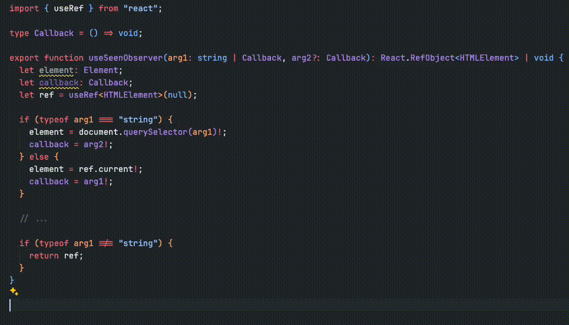
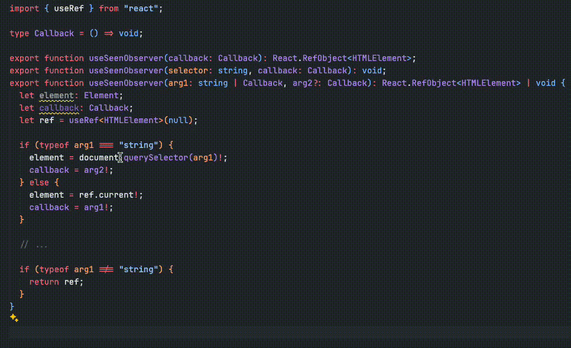

**Function overloading**, birçok programlama dilinde mevcut olan bir özelliktir. Aynı davranışı sergileyen ve aynı adı taşıyan birden fazla fonksiyon tanımlamanıza olanak tanır. Derleyici tarafından parametre sayısı ve tipiyle birbirinden ayrıştırılır. Bu özellik sayesinde kodun kullanılabilirliği, okunabilirliğini ve esnekliği artmış olur.

## Function overloading in OOP languages

Java ve C++ gibi öz hakiki OOP dillerinde ana konseptlerden biridir. Derleyici doğru fonksiyonu çağırmak için fonksiyon ismi ve parametre türlerinden oluşan signature'a bakarak karar verir.

### Java example

Java'da implementasyonu aşağıdaki gibidir:

```java
class Notification {
  void send(String email, String message) {
    // ...
  }

  void send(String email, String message, boolean isUrgent) {
    // ...
  }

  void send(String email, String subject, String body) {
    // ...
  }
}

public class Main {
  public static void main(String[] args) {
    Notification notifier = new Notification();

    notifier.send("Hello!");
    notifier.send(
      "Reminder",
      "The meeting time has been changed to 10 AM."
    );
    notifier.send(
      "ensbaspinar@gmail.com",
      "Can you send me the plans for the team?",
      true
    );
  }
}
```

### C++ example

C++'da da benzer bir implementasyon mevcuttur:

```cpp
class Notification {
public:
  void send(const string& message) {
    // ...
  }

  void send(const string& subject, const string& body) {
    // ...
  }

  void send(const string& email, const string& message, bool isUrgent) {
    // ...
  }
};

int main() {
  Notification notifier;

  notifier.send("Hello!");
  notifier.send(
    "Reminder",
    "The meeting time has been changed to 10 AM."
  );
  notifier.send(
    "ensbaspinar@gmail.com",
    "Can you send me the plans for the team?",
    true
  );
}
```

Her iki dilde de overload resolution derleme zamanında yapılır, bu da sağlanan argümanlara göre uygun yöntemin çağrılmasını kesinleştirir.

### How to handles function overloading?

1. **Function Signatures:** Derleyici, aynı isme sahip fonksiyonların signature'larını kontrol eder. Eğer bu fonksiyonların parametre listeleri farklıysa, derleme başarılı olur; aksi takdirde derleme hatası oluşur.
2. **Name Mangling:** Aynı isme sahip fonksiyonları ayırt etmek için name mangling tekniğini kullanır. Bu teknik, fonksiyon adlarını parametre türleri ve sayılarıyla birlikte kodlayarak benzersiz hale getirir. Örneğin, `foo(int, double)` ve `foo(double, double)` fonksiyonlarının isimleri derleyicide `foo_id` ve `foo_dd` olarak temsil edilir.
3. **Call Resolution:** Fonksiyon çağrıldığında derleyici argüman türlerini kontrol eder ve uygun fonksiyonu bulur.

## Function overloading in TypeScript

TypeScript, JavaScript'in statik tiplerle genişletilmiş üst kümesi olarak function overloading destekler ancak bu işlemi geleneksel OOP dillerinden farklı ele alır. Birden fazla fonksiyon signature'ı tanımlanır ancak implementasyon tek fonksiyonda yapılır.

### Example

```typescript
class Notification {
  send(message: string): void;
  send(subject: string, body: string): void;
  send(email: string, message: string, isUrgent?: boolean): void;

  send(arg1: unknown, arg2?: unknown, arg3?: unknown): void {
    if (typeof arg1 === "string" && !arg2 && !arg3) {
      // ...
    } else if (typeof arg1 === "string" && typeof arg2 === "string" && !arg3) {
      // ...
    } else if (typeof arg1 === "string" && typeof arg2 === "string" && typeof arg3 === "boolean") {
      // ...
    }
  }
}

const notifier = new Notification();

notifier.send("Hello!");
notifier.send("Hello!");
notifier.send(
  "Reminder",
  "The meeting time has been changed to 10 AM."
);
notifier.send(
  "ensbaspinar@gmail.com",
  "Can you send me the plans for the team?",
  true
);
```

### Example 2

In the second example, let's see how to change the behavior in a hook we created in React.

```typescript
type Callback = () => void;

export function useSeenObserver(callback: Callback): React.RefObject<HTMLElement>;
export function useSeenObserver(selector: string, callback: Callback): void;
export function useSeenObserver(arg1: string | Callback, arg2?: Callback): React.RefObject<HTMLElement> | void {
  let element: Element;
  let callback: Callback;
  let ref = useRef<HTMLElement>(null);

  if (typeof arg1 === "string") {
    element = document.querySelector(arg1)!;
    callback = arg2!;
  } else {
    element = ref.current!;
    callback = arg1!;
  }

  // ...

  if (typeof arg1 !== "string") {
    return ref;
  }
}

/* Usage 1 */
const ref = useSeenObserver(() => {
  // ...
});

/* Usage 2 */
useSeenObserver("#component", () => {
  // ...
});
```

### How to handles function overloading?

1. **Checking Function Signatures:** Fonksiyonun belirtilen signature'lardan biriyle uyumlu olup olmadığını görmek için derleme zamanında türü kontrol eder. Aynı zamanda geliştirme esnasında statik kontroller gerçekleştirerek uyumsuzluklar hakkında uyarır.
2. **Call Resolution:** Typescript, JavaScript'e derlendiğinden dolayı **type safety** ve **signature check** işlemleri run-time'da çalışmaz. Bu sebepten ötürü fonksiyonun içerisinde parametre türlerinin koşullarla kontrol edilmesi gerekir.

### Why should I use it?

Typescript'te union kullanmak yerine neden signature kullanmalıyım sorusu aklınıza gelebilir. Son örneği signature kullanmadan yeniden yazalım.

```typescript
type Callback = () => void;

export function useSeenObserver(arg1: string | Callback, arg2?: Callback): React.RefObject<HTMLElement> | void {
  let element: Element;
  let callback: Callback;
  let ref = useRef<HTMLElement>(null);

  if (typeof arg1 === "string") {
    element = document.querySelector(arg1)!;
    callback = arg2!;
  } else {
    element = ref.current!;
    callback = arg1!;
  }

  // ...

  if (typeof arg1 !== "string") {
    return ref;
  }
}
```

Daha sonra, `useSeenObserver' hook'unu kullandığımızda TypeScript'in önerdiği tipe ve yaptığı kontrole bakalım.



Görebileceğiniz gibi net bir function overloading template veremez. Argüman isimleri anlamsız kalır. Hangi parametrenin hangisiyle birlikte kullanılması gerektiği konusu bulanıklaşır. Aşağıdaki varyantlarda, hatalı kullanımlar da dahil, TypeScript hata vermez:

- `(arg1: string)` -> hatalı kullanım
- `(arg1: string, arg2: Callback)`
- `(arg1: Callback)`
- `(arg1: Callback, arg2: Callback)` -> hatalı kullanım

Signature kullandığınızda ise aşağıdaki gibi doğru bir API elde etmiş olursunuz.

