## 📌 Genel Bakış

- **Çıkış Tarihi:** 25 Eylül 2020
- **Geliştirici / Yayıncı:** Hangar 13 / 2K Games
- **Platformlar:** PC, PlayStation 4, Xbox One
- **Tür:** Aksiyon, Macera, Açık Dünya
- **Ortalama Oynanış Süresi:** ~8 saat

Oyun, **1930-1951** yıllarında **Amerika**’nın **Illinois** eyaletindeki kurgusal **Lost Heaven**
şehrinde geçiyor.

**Thomas "Tommy" Angelo**, sıradan bir taksi şoförüdür. Günlerden bir gün, taksisine binen
**Salieri** ailesinin adamları **Paulie** ve **Sam**, onları **Morello** ailesinin kurduğu bir
pusudan kurtarmasını isterler. Kovalamacanın ardından Tommy, onları sağ salim götürür. Ardından Morello
üyeleri onu bulunca ** Salieri Bar**'a sığınır ve onlara katılır. Başlangıçta küçük işler yaparken,
zamanla araba kaçırma, çatışma ve banka soygunları gibi işlerle yerini sağlamlaştırır.

Oyun boyunca Tommy, hem suç dünyasında yükselir hem de ailesini koruma çabasıyla içsel bir çatışma
yaşar. Hikaye, mafya geleneklerine uygun şekilde trajik ama etkileyici bir sonla tamamlanır.

---

## 🎨 Grafik & Atmosfer

**Mekan**: Lost Heaven, Illinois (kurgusal), USA  
**Tarih**: 1930–1938

Orijinal oyun 2002’de çıkmış olsa da, 2020 remake’i grafik açısından oldukça başarılı. Lost Heaven
şehri, dönemin atmosferini ve dokusunu etkileyici şekilde hissettiriyor. Mekanlarda dolaşırken
ışıklandırma ve renkler göze batan bir izlenim yaratmıyor; özellikle gece sahnelerinde
kullanılan sis efektleri güzel olmuş.

Orijinal oyun 2002’de çıkmış olsa da 2020 remake’i görsellik açısından oldukça başarılı. Lost Heaven şehri,
dönemin atmosferini ve dokusunu hissettirecek şekilde yeniden tasarlanmış. Mekanlarda dolaşırken ışık
ve renkler keyifli; özellikle gece sahnelerindeki sis efektleri güzel kullanılmış.

Sanat tarzı ve renk paleti, mafya dünyasının karanlık ve yoğun havasını çok iyi yansıtıyor. Karakter
animasyonları akıcı ve doğal; fakat öfke ve üzüntü duyguları biraz yüzeysel kalmış. Hikayenin
geçtiği mekan tasarımları güzel olsa da açık dünyadaki mekanlar interaksiyon olmadığından olsa gerek
yalapşap yapılmış.

Ve tabii ki bir de polis atmosferi var. Kuralları çiğnediğinizde (araba çalmak, hız sınırını aşmak,
çatışmaya girmek vs.), polis radyosundan anonslar duyuyorsunuz. İnsana "hassiktir peşimdeler"
dedirtiyor ve hikâyeye güzel bir gerçeklik katıyor.

Ek olarak oyunun sinematiği oyuncuyu hikaye başlamadan atmosferi anlatma konusunda son derece başarılıdır.

Sinematik sahneler de oyuna girerken atmosferi mükemmel şekilde kuruyor. Oyuncu daha hikaye başlamadan
Lost Heaven’daki yaşama aşina oluyor.

<iframe
  width="560"
  height="315"
  src="https://www.youtube.com/embed/s9IbBEW0Zww?si=bHJVkWwfn8wKxc5D"
  title="YouTube video player"
  frameborder="0"
  allow="accelerometer; autoplay; clipboard-write; encrypted-media; gyroscope; picture-in-picture; web-share"
  referrerpolicy="strict-origin-when-cross-origin"
  allowfullscreen
></iframe>

---

## 🎶 Ses & Müzik

Karakter seslendirmeleri, karakterlerin mizacına oldukça iyi oturmuş. Özellikle **Paulie**’nin eğlenceli
sesine bayıldım.

Soundtrack’ler mafya havasını güzel yansıtıyor. Aksiyon sahnelerinde yükselen müzikler gerilimi
hissedilir kılıyor. Aksiyonla gerilimin harmanlandığı sahneleri seviyorum.

<iframe
  width="560"
  height="315"
  src="https://www.youtube.com/embed/uQod_FJecyQ?si=udvddIEyZ5Bhn6an"
  title="YouTube video player"
  frameborder="0"
  allow="accelerometer; autoplay; clipboard-write; encrypted-media; gyroscope; picture-in-picture; web-share"
  referrerpolicy="strict-origin-when-cross-origin"
  allowfullscreen
></iframe>

Diğer sountrack'lere de [playlist](https://www.youtube.com/playlist?list=PL8UbYpPIoqN11zZoX8elOb3FkV53Lfyvy) üzerinden ulaşabilirsiniz.

---

## 🎮 Oynanış

2002 yapımı orijinal oyunun remake’i olsa da oynanış neredeyse aynı; modern dinamikler eklenmemiş.
Bazı oyuncular açık dünya etkileşiminin sınırlı olmasını nostaljik bulabilir, bazıları ise
"beyhude sürüş ve çatışma" hissiyle hüsrana uğrayabilir.

### Araç

- Tüm araçlar garaja otomatik eklenir, renk ve küçük özellikler değiştirilebilir.
- Araç çalmak için **lock picking** veya kaba kuvvet uygulanır.
- Araçların benzini tükenebilir; bittiğinde hız 15–20 mph’ye düşer. Benzinlik interaksiyonu yok.

### Sağlık

- Çatışma dışı kaldığında sağlığın %20’si yenilenir.
- Görev mekanlarında bulunan dolaplar sayesinde can yenilenebilir. Normal zorlukta oynadım ve
  sağlık konusunda sorun yaşamadım.

### Polis

- Polisler işlenen suçlara göre farklı tepkiler verir.
- Vatandaşlar suç gördüğünde polisi arıyorlar ve polis alanı araştırmaya başlıyor.
- Kovalamaca sırasında şehri turlamak ya da şehirdeki tuzak noktalarını kullanarak kaçmak mümkün.

---

## 🎭 Önemli Karakterler

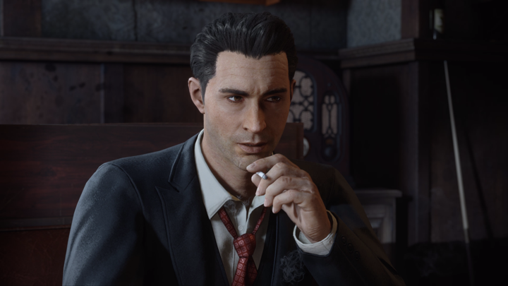

**Tommy Angelo**: Taksi şoföründen mafyanın güvenilir üyesine dönüşen kahramanımız.

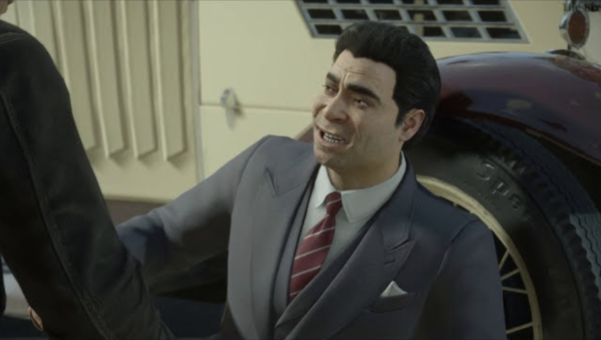

**Paulie Lombardo**: Salieri ailesinin üyesi. Tommy’nin tek gerçek dostu.

**Sam Trapani**: Sadakati sorgulanabilir, bazen sürpriz hareketler yapan adam.

**Don Salieri**: Salieri ailesinin patronu.

**Frank Colletti**: Salieri ailesinin ikinci adamı.

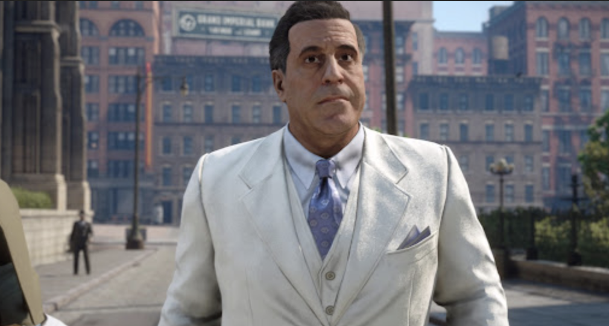

**Don Morello**: Salieri’nin rakibi, Morello ailesinin patronu.

**Sarah Angelo**: Sarieli ailesinin bir ferdi ve Tommy’nin hanımı.

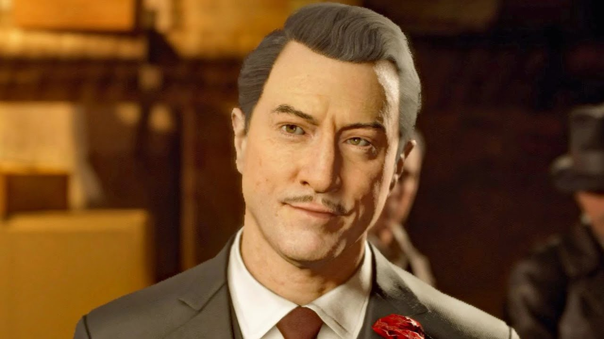

**Sergio Morello**: Don Morello'nun öz kardeşi, Morello ailesinin ikinci adamı.

**Detective Norman**: Tommy’nin geçmişini sorgulayan ve Sarieli'yi hapse tıkan dedektif.

## 📖 Hikaye

Oyun tarihsel olarak 4 döneme ayrılmış: Prologue (1938), 1930, 1932, 1933, 1935, 1938, Epilogue (1951).

### Prologue

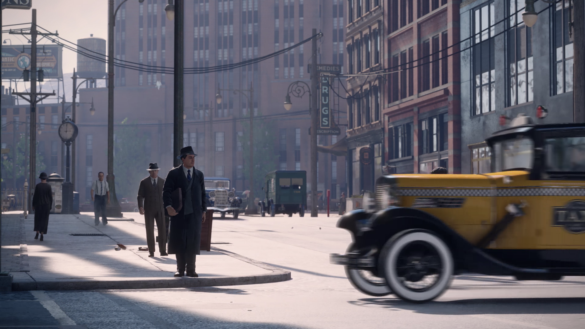

1938'de **Tommy Angelo**, artık eski bir mafya üyesi olarak sessiz bir hayat sürmektedir.

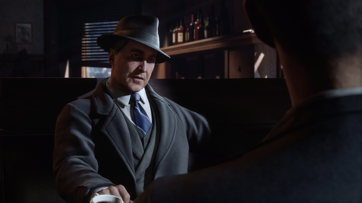

**Tommy**, **Norman** adındaki dedektifle görüşmeye gider. Dedektif, üç yıldır peşinde olduğunu ve eğer
isterse onu ömür boyu hapse atabileceğini söyler. Tommy ise ona kendisini bırakıp büyük balığın peşinden
gitmesini ve Salieri ailesini çökertmek için gerekli olan maliye defterlerinin elinde olduğunu söyler;
karşılığında ise ailesinin güvenliğinin sağlanmasını ister. Çünkü eski bir Salieri üyesi olarak hâlâ tehlikededir.

Asıl hikaye, Tommy ile Norman arasındaki bu konuşma sırasında anlatılan flashback’ler üzerinden ilerliyor.
Yani oyunda olan olayların çoğunu, Tommy’nin geçmişini hatırlamasıyla öğreniyoruz.

### 1930

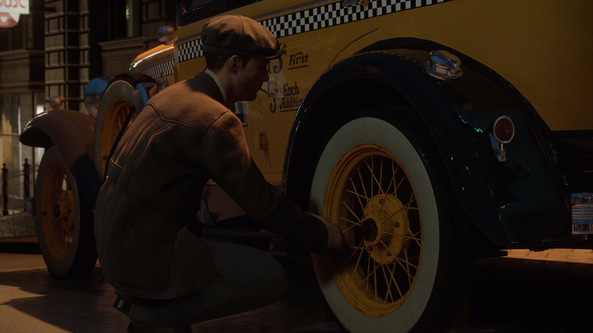

Günlerden bir gün taksiye çıkan **Tommy** ibnelik yapmayarak yolcuların tümünü alıp istediği yer
götürür ve ardından mola için durduğu yerde arabasıyla ilgilenir.

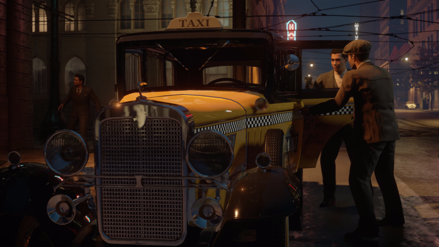

Tam o sırada, **Salieri** ailesinden **Sam** ve **Paulie**, **Morello** ailesinin adamları tarafından
yapılan pusudan kaçarken Tommy’nin taksisine rastlar. Silah zoruyla onu taksiye bindirirler ve gaza
basmasını isterler. Kovalamacanın sonunda Tommy, onları güvenle **Salieri Bar**’a ulaştırır. Bu cesareti
sayesinde **Don Salieri**’nin saygısını kazanır.

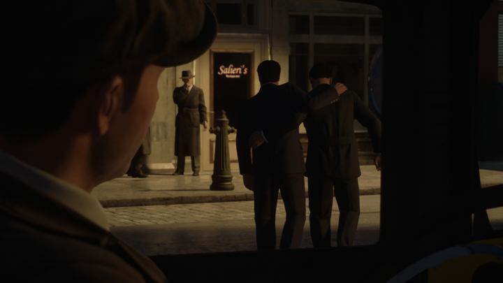

Verecekleri parayı gergin gergin bekleyen Tommy'ye onlar için çalışmasını teklif ederler. Bana
dokunmayın hocam diyen Tommy reddeder.

Tommy, teklif ettikleri parayı gergin gergin beklerken, Salieri ona aile için çalışmayı teklif ederler.
Tommy ise "Aman beni salın hocam" diyerek reddeder.

Ertesi gün, yine ekmeğinin peşindeyken Morello’nun adamları plakasını tanır ve arabasını
paramparça ederler. Tommy’yi döverlerken kaçmaya başlar ve çaresizce Salieri’nin mekanına
sığınır. İşte o an, intikam için aileye katılmaya karar verir. Deneme sürecinde Morello’nun garajını
patlatma işini yapar ve böylece Salieri ailesine resmi olarak girmiş olur.

### 1932

Geçen iki yılın ardından, Tommy ailede kendine sağlam bir yer edinir ve küçük işlerle uğraşmaya devam
eder.

Geleneksel Lost Heaven sokak yarışı vakti gelmiştir ancak başlamadan işler karışır: Salieri ailesinin
bahis oynadığı yarışçı rakip tarafından bir daha araba kullanamayacak şekilde hastanelik edilir.
Aralarında araba sürmeyi en iyi bilen kişi olan Tommy'e güvenirler. Yarışa zorla katılan Tommy,
kazanarak günü kurtarır.

Tommy, aile işlerine dâhil oldukça Sarieli ailesinin bir üyesi olan **Sarah** ile olan ilişkisi
derinleşir ve güzel bir yola adım atarlar.

Sarah evine giderken sürekli onu rahatsız eden çeteye misilleme yapmaları gerekir. Fakat görev sırasında işler sarpa sarar;
yanlışlıkla belediye meclis üyesinin oğlunu öldürürler ve artık yeni bir düşman kazanırlar. Tommy,
**Michelle** isimli muhbirin daha fazla konuşmadan ortadan kaldırılması için harekete geçer. Ancak
muhbirin kardeşiyle tehdit edildiği için yaptığını öğrenir ve vicdanı dayanamaz; onu serbest bırakır
ve Salieri’ye öldüğünü söyler.

Bu olayların ardından belediye meclisi Morello’nun kontrolüne girer ve yozlaşmış polisler Salieri’nin
hemen her anını takip etmektedirler.

### 1933

Tommy artık sadece görevleri yerine getiren bir üye değil; aile içindeki stratejik kararları da
etkileyen önemli bir figür haline gelmiştir. Bu sırada, Morello ailesiyle savaş giderek şiddetlenir.

Salieri, **Frank**’in **FBI** ile işbirliği yaptığını ve ailenin kara para aklama faaliyetleri hakkında
bilgiler verdiğini öğrenince işler karışır. Salieri, Tommy’den Frank’i ortadan kaldırmasını ister ve
o da havaalanına doğru yola çıkar. Ancak Tommy, Frank’in karısı ve çocuklarını korumak için aileye ihanet
ettiğini öğrenir ve yine vicdanı dayanamaz Frank’in ülkeden kaçmasına yardım eder. Karşılığında Salieri'nin
belgelerini Frank'ten alır.

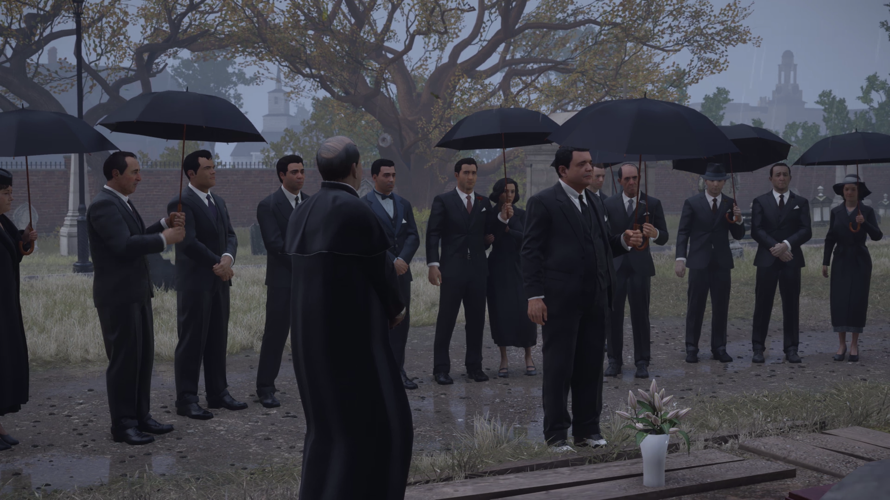

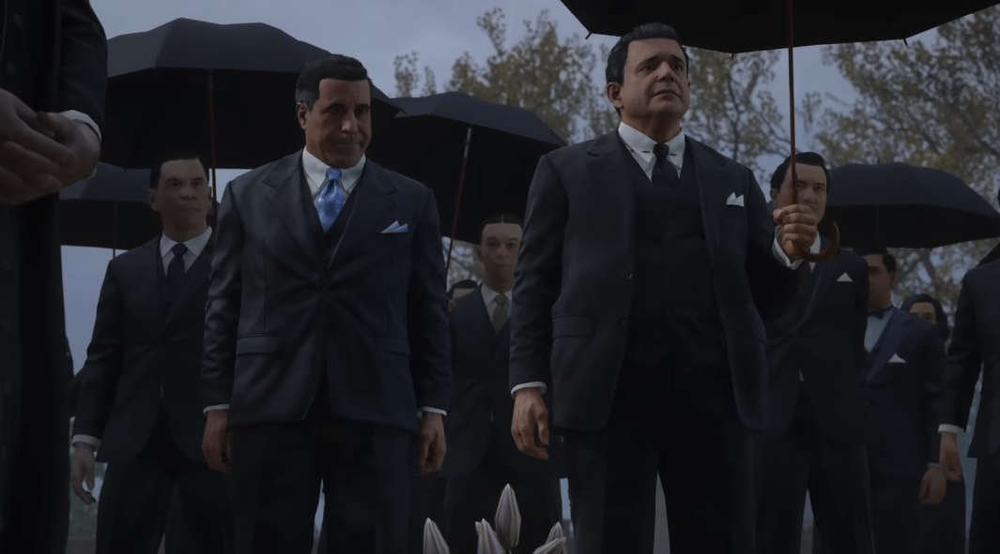

Frank’in öldüğünü sanan Salieri ailesi, cenaze töreninde bir araya gelir ve dua eder. O esnada
Morello da cenazeye katılır.

Bir zaman sonra Tommy ve Sarah evlenirler. Bu küçük mutluluk, karanlık dünyaya biraz neşe katar.

### 1935

Hükümet artık içki yasağını kaldırınca, Morello ve Salieri aileleri faaliyetlerini başka alanlara
kaydırmak zorunda kalır.

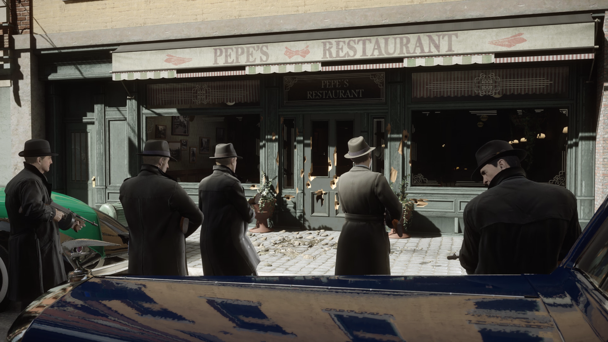

Salieri, meclisi ve polisleri, yani kısacası devleti kontrolü altına almak ister. Tommy ile gittikleri
bir restoranda Morello’nun adamları tarafından suikaste uğrarlar. Neyse ki canlarını zor kurtarırlar
ve artık şehirde topyekün bir savaş başlamıştır.

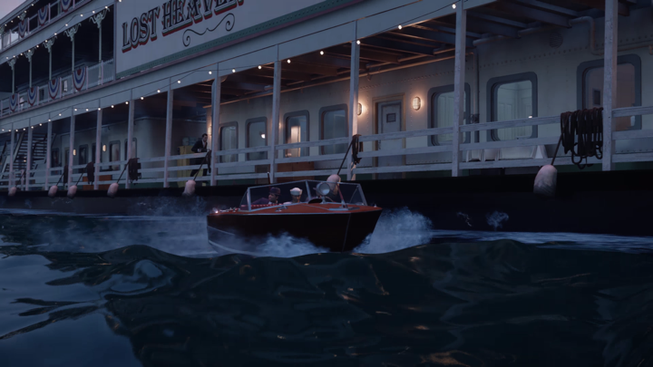

Tommy, Morello’nun siyasi etkisini zayıflatmak için yozlaşmış bir meclis üyesine teknede suikast
yapar. Bu intihar saldırısından çatışarak sağ salim kurtulur.

Morello'nun etkisini daha da azaltmak isteyen Salieri ailesi, Morello’nun kardeşi **Sergio**’yu limanda
kontrol yaptığı esnada ortadan kaldırır.

Artık geri dönüşü olmayan noktaya gelen Salieri, son noktayı da koymak için bir plan yapar. Morello’nun havaalanına
gittiğini öğrenen Tommy, Paulie ve Sam, havaalanına gider ve şehirden kaçmakta olan Morello’nun
uçağını motorlarına ateş etmek suretiyle düşürürler.

1922’de **Peppone** ailesinin lideri gölde boğulduktan sonra aile üyeleri Salieri ve Morello'nun
şehri aralarında bölüşmelerinden bu yana devam eden kavga, Morello'nun ölümüyle sonuçlanır. Artık
Lost Heaven’ın tek hakimi Salieri'dir.

### 1938

Tommy Angelo, artık yıllardır Salieri ailesinin en güvenilir üyelerinden biridir. Fakat aile
içindeki güven ve sadakat duyguları ciddi şekilde zedelenmiştir.

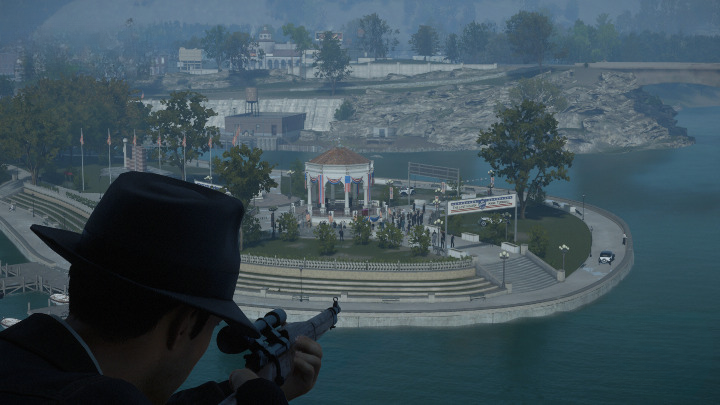

Geleceğin vali adaylarından **Turnbell** isimli bir adam, Salieri’nin işlerini çökertmek için aleyhinde
konuşmaya başlayınca göze batmaya başlar. Don Salieri, herkese ibret olsun diye seçim kampanyası
sırasında halkın gözü önünde öldürülmesini ister. Tommy, eski hapishanenin çatısına çıkar ve keskin
nişancı tüfeğiyle tek atışta eşek cennetine gönderir.

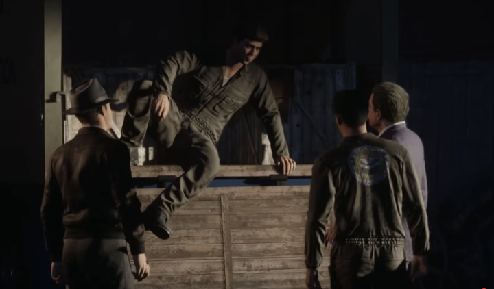

Salieri; Tom, Sam ve Paulie'ye yeni bir iş verir. Federaller limandaki puro sevkiyatına el koymuştur,
ama bunlar aslında kaçak elmas sevkiyatı için bir kılıftır. Bu durum Tommy'nin içine sinmez çünkü
kazanca göre risk çok büyüktür. İş tamamlandığında malı kontrol ederler ve aslında elmas değil
uyuşturucu olduğunu fark ederler. Salieri geldiğinde, malların onların değil başkalarının
taşıyacağını söyler; yani kandırılmışlardır.

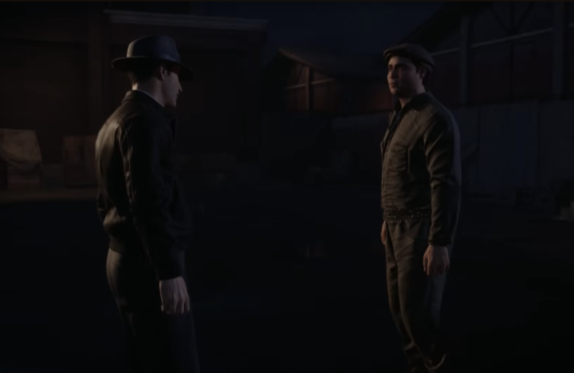

Paulie ve Tommy bu durumdan öfkelenir. Yakalansalardı ömür boyu hapiste çürüyeceklerini bilirler.
Paulie daha öncesinde şehir merkezinde banka soygunu yapıp büyük vurgun planından bahsetmiştir; Sam ise
bunun Salieri’yi sinirlendireceğini ama yapacaksa bir şey diyemeyeceğini söylemiştir. Tommy
başlangıçta bu işe sıcak bakmasa da, Salieri’nin işlerinin onlara sadece ölüm ve tehlike getireceğini
düşündüğü için kabul eder.

Soygun başarıyla tamamlanır ve paylaşmak için buluşmak üzere ayrılırlar. Paulie para çuvalıyla evine
gider. Ancak soygunun ardından işler değişmektedir.

Soygundan payını almak için Paulie’nin evine giden Tommy, infaz edildiğini görür ve yıkılır.
Bunun Salieri’nin işi olduğunu anlar. Kendi hayatının da tehlikede olduğunu fark eden Tommy, artık
tek yolun aileden kopmak ve Salieri’ye karşı hareket etmek olduğuna karar verir.

Tam o sırada telefon çalar; Sam, Salieri’nin banka işini öğrendiğini söyleyerek Paulie’yi uyarmak istemiştir.
Artık çok geçtir. Tommy, Sam’den ailesini şehir dışına çıkarması için para ayarlamasını ister ve
onunla buluşmak üzere şehir galerisine doğru yola çıkar.

Ama puşt Sam, Tommy’yi pusuya düşürür. Adamlarından kafasına sıkmasını ister; ancak Tommy pusudan kurtulur ve Sam’in üzerine gider.

Sam için artık yolun sonu gelmiştir ve hakettiği şekilde hayata gözlerini yumar.

Flashback biter ve Norman, Tommy’ye mahkeme karşısında Salieri aleyhine şahitlik etmesini ister.

### Epilogue (1951)

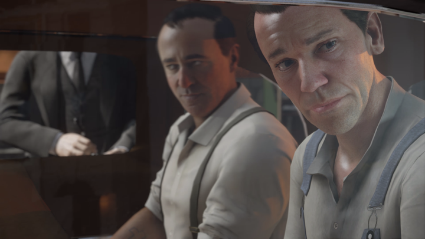

Sam mahkemede Salieri aleyhine şahitlik yapmış ve sonuçta tüm aile üyeleri müebbet hapse mahkum edilmiştir.

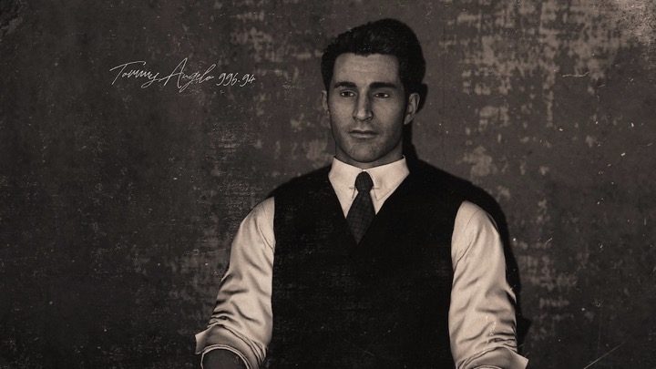

Tommy ise müebbette yırtmış olsa da, uzun bir süre hapiste yatmıştır.

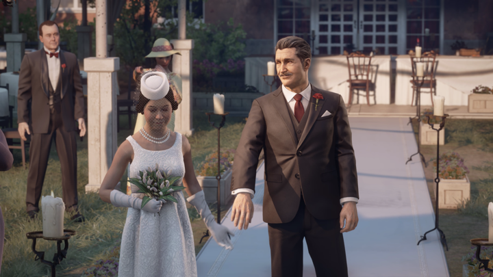

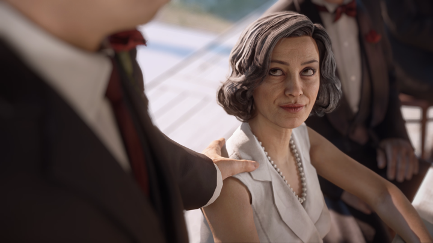

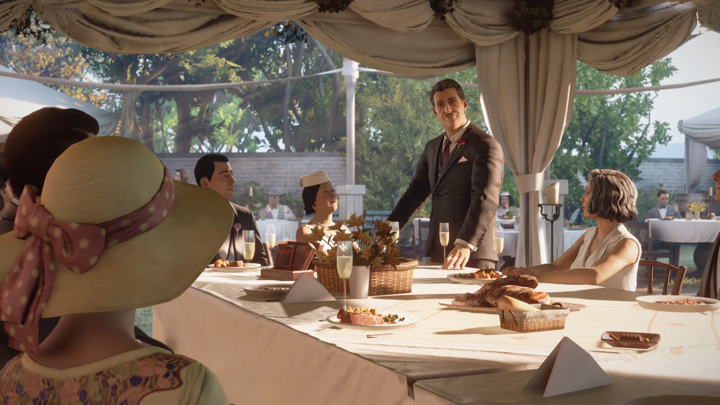

Geçmek bilmeyen 13 yılın ardından tahliye olan Tommy, sonunda Sarah’ına ve ailesine kavuşur. Hatta
kızının mürvetini görmenin mutluluğunu yaşar.

Ama bilirsin, pisliğe bulaşan insanların geçmişi peşini bırakmaz. Salieri, Tommy’nin izini bulur ve
gönderdiği adamlar aracılığıyla selamını iletir.

"Herkes yaptığının bedelini öder, Tommy." Allah rahmet eylesin.

## Değerlendirme

**Metacritic Puanı:** 78/100  
**Benim Puanım:** 6/10

### Artılar:

- Tommy’nin taksi şoföründen mafyanın güvenilir üyesine dönüşme hikayesi samimi ve etkileyici.
- Oyunun orijinaline göre daha sinematik bir hale getirilmesini açıkçası sevdim; anlatım kalitesi
  güzel.
- Müzikler olayın atmosferini yanstıyor ve keyifli.

### Eksiler:

- Salieri ile pizzacıya iki kişi gidip baskın yediğimiz sahnede, şehrin yarısının sahibi adam kendi
  hakimiyetindeki bölgede canını zor kurtarıyor ve uzun süre yardım gelmiyor. Morello’yu öldürmeye
  gittiğimizde ise etrafında sadece üç beş adam var. Sam’i öldürürken bile daha fazla adam tarafından
  korunuyor. Yani oyunun en büyük boss’unu kesiyormuş gibi bir his veriyor ama halbu ki öyle değil.
- Salieri tarafından bileti kesilen Tommy neden onun üzerine gitmedi? Belki aile olarak gördüğü
  kişilere vicdan yapıyordur ama ben o aidiyet ve sadakat duygusunu oyunda hiç hissetmedim.
- Duygular çoğu zaman geçmiyor. Örneğin final sahnesinde mafya hayatının sonunu çok güzel
  hissettirmelerine rağmen, Tommy’nin ailesinin acısı bana geçmedi. Hızlıca geçilmiş bir sahne. Aile
  üyelerinin yüz ifadelerini bile göremedik.
- Don Salieri ve Don Morello’nun aynı ailede olduğu, aile reisinin ölümüyle şehri ikiye bölüp düşman
  oldukları sadece Norman ile yapılan bir görüşmede bir cümleyle anlatılmış. Halbuki burası hikayenin
  önemli noktalarından biri.
- Açık dünya deniyor ama side-quest yok, şehirle etkileşim sınırlı; çoğunlukla sadece araba sürüyorsun.
